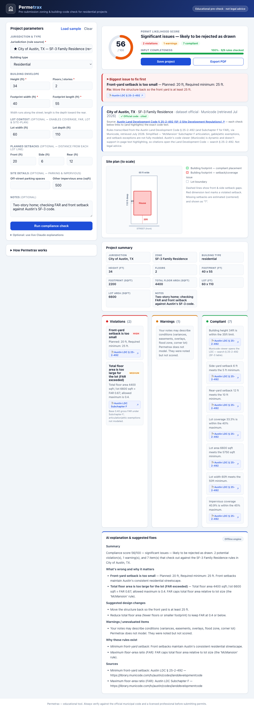

# Permetrax

**An educational zoning & building-code pre-check for residential projects.**
Describe a building concept and Permetrax tells you whether it likely complies with a
jurisdiction's zoning rules — flagging violations, drawing a to-scale site plan, scoring
permit likelihood, and **citing the exact code section behind every check.**

[](https://permetrax.netlify.app)
[](LICENSE)


🔗 **Live:** https://permetrax.netlify.app &nbsp;·&nbsp; https://allanberkedemunnink-prog.github.io/permetrax/



> ⚠️ **Educational tool — not legal advice.** Permetrax runs against simplified rule sets
> (one real, cited jurisdiction plus clearly-labeled fictional samples). It does not replace
> the official municipal code or a licensed professional.

---

## The problem

Permit applications for simple residential projects get rejected all the time for
*knowable* reasons — exceeding a height limit, missing a setback, over-covering the lot.
Catching those before you pay for drawings saves weeks and money. Permetrax is a fast
pre-check that flags likely issues and explains them in plain English.

## The key design decision

**The rule engine is deterministic. The LLM never decides compliance.**

- Every pass/fail and every calculation runs in plain JavaScript, so results are
  **reproducible and auditable** — the same input always gives the same answer.
- An LLM (Claude, optional) is confined to a single job: **explaining** the engine's
  output and suggesting fixes. It is explicitly prevented from inventing rules or changing
  a verdict. With no API key, a built-in deterministic explainer is used instead, so the
  app is fully functional offline.

This separation is the whole point: zoning compliance has to be trustworthy, and letting a
language model "decide" it would be neither reproducible nor explainable.

```
 form input ──▶ deterministic rule engine ──▶ structured result ──▶ explanation layer
 (your design)   (all math + pass/fail)        (score, findings,      (plain English;
                                                 citations)             LLM = explain only)
```

## What it does

- **Checks** height, stories, front/side/rear setbacks, lot coverage, floor-area ratio
  (FAR), minimum lot area & width, off-street parking, and impervious coverage — *whichever
  rules a given jurisdiction defines.*
- **Scores** a 0–100 "permit likelihood" with a severity-weighted model and a plain-English
  rating.
- **Draws a to-scale site plan** (SVG): your footprint placed on the lot by its setbacks,
  colored green if it fits / red if it violates a setback or coverage rule.
- **Cites every check.** For the real jurisdiction, each finding links to the **exact code
  section** in the official online code (deep links). Sample jurisdictions are clearly
  labeled as illustrative.
- **Explains** results: summary, what's wrong & why, suggested fixes, why the rules exist,
  and a sources list (also in the PDF export).
- **Saves** projects (browser `localStorage`) and **exports a PDF** report.

## Jurisdictions

| Jurisdiction | Type | Source |
|---|---|---|
| ★ **City of Redondo Beach, CA** — R-1 | **Real, fully cited** | Municipal Code § 10-2.2503 (eCode360) — every rule links to its section |
| Township of Maple Grove, NJ — R-1 | Fictional sample | Illustrative only |
| City of Lakeside, CA — R-2 | Fictional sample | Illustrative only |
| Town of Brookfield, TX — SF-2 | Fictional sample | Illustrative only |

## Run it

It's a **single self-contained file** — no build, no server, no dependencies.

- **Online:** use the live links above.
- **Locally:** download `index.html` and double-click it.

Then click **Load sample → Run compliance check**. (Optional: paste an Anthropic API key in
the collapsible panel to get live Claude explanations instead of the built-in ones.)

## Adapt it for your jurisdiction

The rules live in the `JURISDICTIONS` object near the top of the `<script>` in `index.html`.
Each rule is data, not logic:

```js
max_height_ft: {
  value: 30, severity: "high", label: "Maximum building height",
  why: "Height limits protect neighbors' light, air, and views.",
  citation: { code: "Your Muni. Code", section: "§ 1-2.3",
              url: "https://…/your-code#section-anchor" }
}
```

Add a new jurisdiction object, fill in the numeric limits and citations, and the engine,
scoring, site plan, and explanations pick it up automatically. No logic changes required.

📖 **Full walkthrough: [ADAPTING.md](ADAPTING.md)** — the rule-key reference, how to wire
clickable + self-highlighting citations, scoring knobs, and a step-by-step for adding a real
jurisdiction.

## Tech

Vanilla HTML / CSS / JavaScript. Zero dependencies, no build step. Deterministic rule
engine, inline SVG site plan and score gauge, `localStorage` persistence, print-to-PDF
export, and an optional direct-from-browser Claude integration.

## Limitations (by design)

Models **residential only** and **simplified** standards. It does **not** handle setback
averaging, FAR bonuses, overlay districts, variances, ADUs, corner-lot rules, flood zones,
or historic districts — real codes contain nuances a pre-check shouldn't fake. Three of the
four jurisdictions are fictional teaching examples.

## License

[MIT](LICENSE) — free to use, copy, fork, and modify. If you adapt it for a real
jurisdiction, you're welcome to.

---

Built by **Allan Berkede Munnink**.
